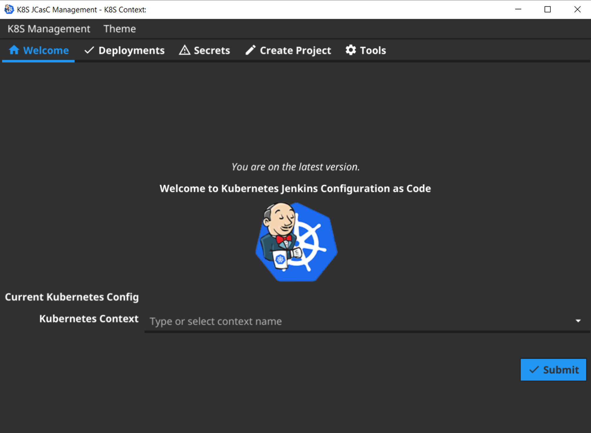

# 2.9.0 Small improvements and dependency updates
## Dependency updates
This release updates the base libraries.
Mainly fyne.io to 1.4.3.

## Bugfixes
Fixed a minor bug where the GUI does not initially display the namespace dropdown.

## Improvements
There is a new option to add a domain for the load balancers.
Domains can be used in the templates with the placeholder "##JENKINS_URL##".

# 2.8.1
## Bugfixes
This version fixes a bug in the resolution of the paths of the alternative secret files.
Now the path for the alternative secrets is always the same as the path of the global secrets file. 

## Dependency updates
Update of the dependencies.

# 2.8.0
## Bugfixes
This version fixes a problem with the namespace events after creating a new project.

## External DNS annotations
This version introduces support for external DNS annotations on the Nginx load balancer service.
To activate it, the following configurations can be changed in your project configuration:

```bash
# enable annotations on the load balancer service
NGINX_LOADBALANCER_ANNOTATIONS_ENABLED=false

# external DNS hostname
NGINX_LOADBALANCER_ANNOTATIONS_EXT_DNS_HOSTNAME="domain.tld"
# external DNS TTL time in seconds
NGINX_LOADBALANCER_ANNOTATIONS_EXT_DNS_TTL=60
```

These values are replacing the annotations block in the [nginx_ingress_helm_values.yaml](templates/nginx_ingress_helm_values.yaml):
```yaml
    annotations:
      enabled: ##NGINX_LOADBALANCER_ANNOTATIONS_ENABLED##
      external_dns_hostname: "##NAMESPACE##.##NGINX_LOADBALANCER_ANNOTATIONS_EXT_DNS_HOSTNAME##"
      external_dns_ttl: ##NGINX_LOADBALANCER_ANNOTATIONS_EXT_DNS_TTL##
```
The default for new DNS names is `<namespace>.<ext_dns_host>`.
This version supports no direct UI edit (but it is possible to abuse e.g. the Jenkins Welcome Message).

Please update this file in the project templates, if modified templates are used.

If own charts are used, please update the following files in the `nginx-ingress-controller` folder:
- [templates/loadbalancer.yaml](charts/nginx-ingress-controller/templates/loadbalancer.yaml)
- [values.yaml](charts/nginx-ingress-controller/values.yaml)


# 2.7.0
This release mainly updates the underlying fyne.io framework to version 1.4.0.
With this update the UI is much better and gets a fresher color scheme.

# 2.6.0
**Introduction of multiple secret files**

To set up multiple secret files, simply add new files in the same directory where the `secrets.sh(.gpg)` is located.
These files need the prefix `secrets_`.


# 2.5.0
* Fixes the error that after project creation the new namespace is not available and the application must be restarted.

# 2.4.0
* Bugfix that Kubernetes Server certificate has not been replaced in the template
* Adding support for multiple cluster certificates
  * The configuration `KUBERNETES_SERVER_CERTIFICATE` is now a fallback/default configuration.
  * With `KUBERNETES_SERVER_CERTIFICATE_<context_name>` it is now possible to add certificates for multiple contexts.
  The context name should not contain spaces!
  * Examples:
    * `KUBERNETES_SERVER_CERTIFICATE_CLUSTER_A` is for the context `cluster_a`
    * `KUBERNETES_SERVER_CERTIFICATE_PRODUCTION-CLUSTER` is for the context `production-cluster`

# 2.3.0
* Adding Kubernetes Context Switch (GUI only)
  * This release introduces the possibility to switch the Kubernetes Context in the app.
  The available contexts has to be configured in the `~.kube/config` file.
  * Configure access to multiple clusters: https://kubernetes.io/docs/tasks/access-application-cluster/configure-access-multiple-clusters/

# 2.2.0
* Update of libraries:
  * fyne: 1.3.2
    * fyne had some cache issues, which are solved with new version
  * crypto (latest branch)

# 2.1.0
* Update of `fyne` to `1.3.1`
* Better support for server only environments
  * It is possible to use `go run -tags cli k8s-jcasc-mgmt.go` to avoid compile with `fyne` and its dependencies (`gcc`, `x11`,...)

# 2.0.1

## Introducing new UI
* K8S-Jcasc-Management supports now native UIs for the following platforms:
  * Windows
  * Linux and BSD
  * MacOS X

This was realized with the [fyne](https://fyne.io/) framework.

To use K8S-JcasC-Management on a CLI, you can start it with the `-cli` flag.

## Build hints
If you have trouble compiling the project, please visit the [fyne developer](https://developer.fyne.io/started/) site first to check the prerequisites.
On Windows, it is recommended to install [TDM-GCC - tdm-gcc.tdragon.net](https://tdm-gcc.tdragon.net), which works very easily. It can be required to set the PATH variable to the `TDM-GCC` directory if the `go` compiler still wants a `GCC`.

### Using on server-systems only (without GUI)
If you have trouble or if you want to use it on a server without `X11`, you can also exchange the `!ignore` and `ignore` in first-line comment at the `/app/app_cli.go` and `/app/app_gui.go` file.
Golang will then use the `app_cli.go` file to compile and ignores the GUI implementation completely.

## Screenshots

### Welcome (Windows)


### Deployment (Mac Dark Theme)


### Create Project (Mac Light Theme)


# 1.13.1
* Hotfix for the configuration of encrypted users.
  * Fixes the issue, that `JENKINS_MASTER_ADMIN_PASSWORD_ENCRYPTED` and `JENKINS_MASTER_PROJECT_USER_PASSWORD_ENCRYPTED` need encrypted password surrounded with `'` characters, that the `bash` version will not interpret this configuration as arguments.

# 1.13.0
* Support for create namespace from k8s-jcasc-mgmt
* Default logging enabled.
  * `k8s_jcasc_mgmt.cnf` has now the following 3 parameters:
    * `K8S_MGMT_LOGGING_LOGFILE`: default is `output.log`. This defines the default logfile. This value can be overwritten with the `-logfile` argument or simply comment it to disable it.
    * `K8S_MGMT_LOGGING_ENCODING`: default is: `console`. Allows the default logging type (`console` or `json`)
    * `K8S_MGMT_LOGGING_OVERWRITE_ON_START`: default is: `true`. Defines if logfile should be re-created on start. In this case, the system moves the old log (if exists) to the defined logfile name with suffix `.1`. Example: `output.log.1`.

# 1.12.1
Features:

* create new projects for Jenkins administration
* manage secrets
    * encrypt/decrypt secrets for secure commit to a VCS (version control system)
    * apply secrets to Kubernetes
        * for each project while installation or as an update (`applySecrets`)
        * for all known namespaces, that are configured in the `ip_config.cnf` file (applySecretsToAll)
    * store secrets globally for easy administration
    * store secrets per project for more security
* manage the Jenkins instances for a namespace with the project configuration
    * install
        * create namespace if it does not exist
        * install Jenkins
        * install nginx-ingress-controller per namespace (if configured)
        * install load balancer and ingress for Jenkins
    * uninstall
        * uninstall Jenkins installation
        * uninstall nginx-ingress-controller per namespace (if configured)
        * uninstall load balancer and ingress for Jenkins (other ingress routes will not be changed)
    * upgrade
* internal log viewer
* logging in JSON or console format

-> This release is equal to the 1.12.1 version of the bash implementation (https://github.com/Ragin-LundF/k8s-jcasc-management).
