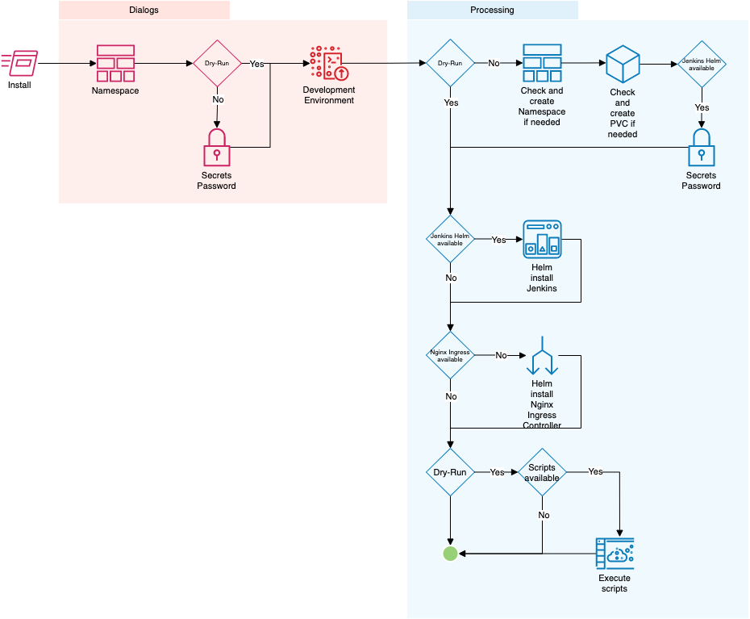

# Process - Installation / Upgrade

Installing the system has some "dependencies" like secrets, load balancer ingress controller and so on.

The correct order is not very important, but it is helpful to understand what is going on.
Also, which impact which switch has to the deployment.

In general there are two things:
- Is it a `dry-run`?
- Is a helm file for xy available (Jenkins, Nginx Ingress Controller, scripts)

Depending on this the deployment does different things.

# Dry Run

This option does not apply secrets or execute scripts.

The main purpose of this option is to find out what the Kubernetes `YAML` files look like when something is not working.

After the execution all `YAML` files are available in the logs (or in the overview in the details).

# Deployment depending on existing files

In some cases it is not required to deploy everything.
For that the system checks, if a file is existing. If not, it skips the step.

With this mechanism it is easy to define which components should be deployed.

For example, it makes no sense to deploy the Nginx Ingress Controller, if the global ingress is active.
It also doesn't make sense to deploy Jenkins in a namespace where a Jenkins instance should only provide applications.
However, it is necessary to define `RBAC`, for example, to make the deployment work.

It can also be used to define a load balancer whose IP is managed in the `k8s-jcasc-mgmt`.
